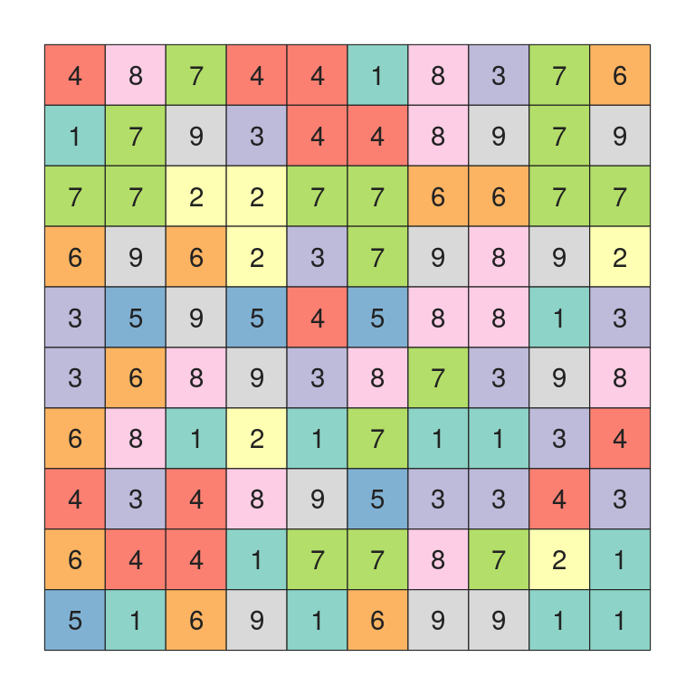
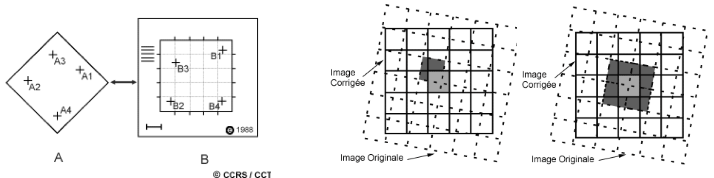
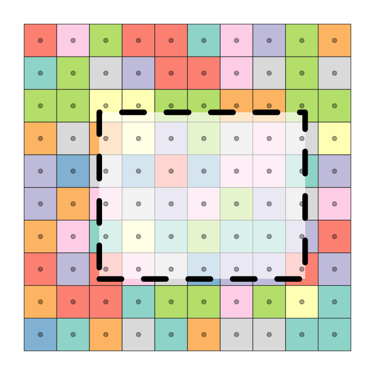
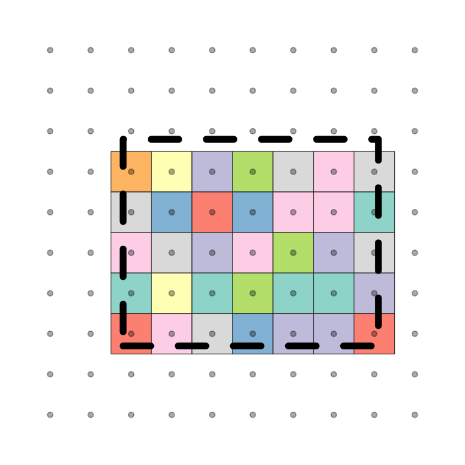
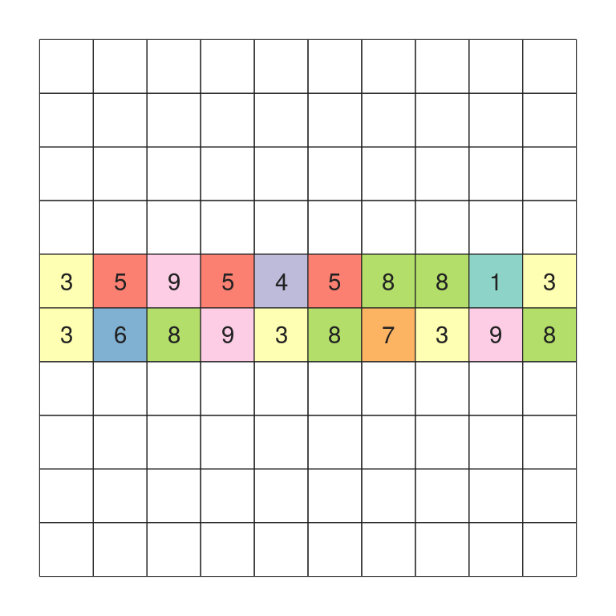
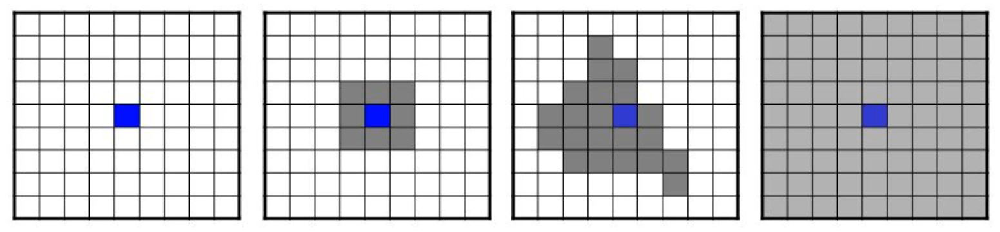
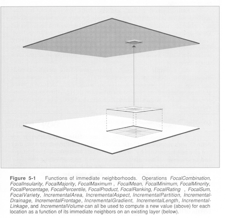
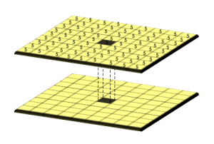

```{r knitr_initx, echo=FALSE, cache = FALSE}
library(knitr)
## Global options
options(max.print="90")
opts_chunk$set(echo = TRUE,
               fig.align = 'center',
               cache = TRUE)
```


# Les données raster: le package terra

## Format des objets `SpatRaster`

Le package `terra` [@R-terra] permet de gérer des données vectorielles et raster. Pour manipuler ces données spatiales, `terra` les stockent dans des objets de type `SpatVector` et `SpatRaster`. Dans ce chapitre, nous nous focalisons sur la manipulation de données raster (`SpatRaster`) à partir de fonctions proposées par ce package.

Un objet `SpatRaster` représente des données matricielles, en une ou plusieurs couches (variables). Cet objet stocke également un certain nombre de paramètres fondamentaux qui le décrivent (nombre de colonnes, de lignes, étendue spatiale, système de référence des coordonnées...).

```{r raster, eval=TRUE, echo=FALSE, fig.align='center', fig.width=5}

```
<center><span style="font-size:80%;color:#A9A9A9;">Source : [@RasterCheatSheet]</span></center>

</br>


## Import et export de données

Le package `terra` permet d'importer et d'exporter des fichiers raster. Il repose sur la bibliothèque [GDAL](https://gdal.org/) qui permet de lire et de traiter un très grand nombre de format d'images géographiques.

```{r terra, message=FALSE}
library(terra)
```

La fonction `rast()` permet de créer et/ou d'importer des données raster. 
Les lignes suivantes importent le fichier raster **elevation.tif** ([*Tagged Image File Format*](https://fr.wikipedia.org/wiki/Tagged_Image_File_Format)) dans un objet de type `SpatRaster` (par défaut).

```{r import_raster, message=FALSE}
Elevation_Lot <- rast("data/elevation.tif") 

Elevation_Lot
```

Modification du nom de la variable stockée (altitude).
```{r names_raster, message=FALSE}
names(Elevation_Lot) <- "Altitude" 
```

La fonction `writeRaster()` permet d'enregistrer un objet `SpatRaster` sur votre machine, dans le format de votre choix.
```{r export_raster, eval=FALSE}
writeRaster(x = Elevation_Lot, filename = "data/new_elevation_Lot.tif")
```


## Affichage d'un objet SpatRaster


La fonction `plot()` permet d'afficher un objet `SpatRaster`.

```{r affichage_1_raster, eval=TRUE, fig.align='center', fig.width=6}
plot(Elevation_Lot)
```


Un raster contient toujours des données numériques, mais il peut aussi bien s'agir de données quantitatives que de données qualitatives (catégorielles) codées numériquement (ex: type d'occupation du sol).

Précisez le type de données stockées avec l'argument `type` (`type = "continuous"` par défaut), pour les afficher correctement.

Import et affichage d'un raster contenant des données catégorielles : CORINE Land Cover 2018 (type d'occupation du sol) avec une résolution de 100m : 

```{r import_raster_2, message=FALSE}
# Import des données CORINE Land Cover 2018 
# Type d'occupation du sol, résolution de 100m
CLC2018_Lot <- rast("data/CLC2018_Lot.tif")
```

Ces données ont été récupérées sur le [site de Copernicus](https://land.copernicus.eu/pan-european/corine-land-cover/clc2018?tab=download), le programme européen de surveillance de la Terre qui collecte et met à disposition des données issues de ses propres satellites (*Sentinelles*) d'observation. Une extraction centrée sur la commune de Cahors a ensuite été réalisée.

```{r affichage_raster_2, fig.align='center', fig.width=6}
plot(CLC2018_Lot, type="classes")
```

Pour afficher les intitulés réels des types d'occupation du sol, ainsi que les couleurs officielles de la nomenclature CORINE Land Cover (consultables [ici](https://www.statistiques.developpement-durable.gouv.fr/corine-land-cover-0)), vous pouvez procéder de la manière suivante.

```{r affichage_raster_3, eval=TRUE, fig.align='center', fig.width=8}

intitule_poste <- c(
  "Tissu urbain continu", "Tissu urbain discontinu",
  "Zones industrielles ou commerciales et installations publiques",
  "Réseaux routier et ferroviaire et espaces associés", 
  "Aéroports","Extraction de matériaux", 
  "Equipements sportifs et de loisirs", 
  "Terres arables hors périmètres d'irrigation", "Vignobles", 
  "Vergers et petits fruits", 
  "Prairies et autres surfaces toujours en herbe à usage agricole", 
  "Systèmes culturaux et parcellaires complexes", 
  "Surfaces essentiellement agricoles (interrompues par espaces nat.)", 
  "Forêts de feuillus", "Forêts de conifères", "Forêts mélangées",
  "Pelouses et pâturages naturels", 
  "Landes et broussailles", "Végétation sclérophylle", 
  "Forêt et végétation arbustive en mutation", 
  "Cours et voies d'eau", "Plans d'eau"
)
couleur_off <- c("#E6004D", "#FF0000", "#CC4DF2", "#CC0000", "#E6CCE6", "#A600CC", 
                 "#FFE6FF", "#FFFFA8", "#E68000", "#F2A64D", "#E6E64D", "#FFE64D", 
                 "#E6CC4D", "#80FF00", "#00A600", "#4DFF00", "#CCF24D", "#A6FF80", 
                 "#A6E64D", "#A6F200", "#00CCF2", "#80F2E6")
plot(CLC2018_Lot, 
     type = "classes", 
     levels = intitule_poste,
     col = couleur_off, 
     plg = list(cex = 0.7),
     mar = c(3, 1.5, 1, 18.5)
     )

```


## Modifications de la zone d'étude 
### (Re)projections

Pour modifier le système de projection d'un raster, utilisez la fonction `project()`. Il est alors nécessaire d'indiquer la méthode d'estimation des nouvelles valeurs des cellules.

```{r project_raster, eval=TRUE, echo=FALSE, fig.align='center', out.width="95%"}

```

<center><span style="font-size:80%;color:#A9A9A9;">Source : Centre Canadien de Télédétection</span></center>

</br>

Quatre méthodes d'estimation sont disponibles :   

- ***near*** : plus proche voisin. Méthode rapide et par défaut pour les données qualitatives;     
- ***bilinear*** : interpolation bilinéaire.  Méthode par défaut pour les données quantitatives;      
- ***cubic*** : interpolation cubique;     
- ***cubicspline*** : interpolation cubique spline.    

```{r reproj_raster, eval=TRUE, fig.align='center', fig.width=8}
# Projection en RGF93 / Lambert-93
Elevation_Lot_L93 <- project(x= Elevation_Lot, y =  "EPSG:2154", method = "bilinear")
CLC2018_Lot_L93 <- project(x= CLC2018_Lot, y = "EPSG:2154", method = "near")
```

```{r reproj_raster_2, eval=TRUE, echo=FALSE, fig.align='center', fig.width = 7}
par(mfrow=c(1,2))
plot(Elevation_Lot_L93,  main="Raster d'élévation projeté en Lambert 93" )
plot(CLC2018_Lot_L93, type ="classes",  main="CLC 2018 projeté en Lambert 93")
```


### Crop

Le découpage d'un raster en fonction de l'étendue d'un autre objet `SpatVector` ou `SpatRaster` est réalisable avec la fonction `crop()`.

```{r crop, eval=TRUE, echo=FALSE,  fig.show='hold'}


```
<center><span style="font-size:80%;color:#A9A9A9;">Source : [@RasterCheatSheet]</span></center>

</br>

Import de données vectorielles (découpages communaux) avec la fonction `vect`. Ces données seront stockées dans un objet `SpatVector`.
```{r crop_raster, eval=TRUE}
commune <- vect("data/lot46.gpkg", layer="commune")
```

Extraction des limites communales de Cahors (code INSEE : 46042).
```{r crop_raster_1, eval=TRUE}
cahors <- subset(commune, commune$INSEE_COM == "46042") 
```

Utilisation de la fonction `crop()`. Les deux couches de données doivent être dans la même projection. 
```{r crop_raster_3, eval=TRUE, fig.align='center', fig.width=6}
crop_cahors <- crop(Elevation_Lot_L93, cahors)

plot(crop_cahors)
plot(cahors, add=TRUE)
```

### Mask

Pour afficher uniquement les valeurs d'un raster contenu dans un polygone, utilisez la fonction `mask()`.

```{r mask, eval=TRUE, echo=FALSE, fig.align='center', fig.width=6}

```
<center><span style="font-size:80%;color:#A9A9A9;">Source : [@RasterCheatSheet]</span></center>

</br>

Création d'un masque sur le raster **crop_cahors** en fonction des limites communales (polygone) de **cahors**.
```{r mask_raster, eval=TRUE, fig.align='center', fig.width=6}
mask_cahors <- mask(crop_cahors, cahors)

plot(mask_cahors)
```

### Agrégation & désagrégation

Le ré-échantillonnage d'un raster dans une résolution différente se fait en deux étapes.

```{r agr_raster_fig, eval=TRUE, echo=FALSE,  fig.show='hold', out.width='33%'}
knitr::include_graphics(c("img/agr_raster_2.png", "img/raster.png", "img/agr_raster.png"))
```
<center><span style="font-size:80%;color:#A9A9A9;">Source : [@RasterCheatSheet]</span></center>

</br>

Afficher la résolution d'un raster avec la fonction `res()`.
```{r agr_raster, eval=TRUE}
# Taille des cellules ?
res(Elevation_Lot_L93) 
```


Créer une grille de même étendue, puis en diminuer la résolution spatiale (plus grosses cellules).
```{r agr_raster_1, eval=TRUE}
Elevation_LowerGrid  <- Elevation_Lot_L93

# Tailles des cellules = 1000 mètres
res(Elevation_LowerGrid) <- 1000
# res(Elevation_HigherGrid) <- 10

Elevation_LowerGrid
```

La fonction `resample()` permet de ré-échantillonner les valeurs de départ dans la nouvelle résolution spatiale. Plusieurs méthodes de ré-échantillonnage sont disponibles (cf. [partie 5.4.1](#reprojections)).
```{r agr_raster_2, eval=TRUE, fig.align='center', fig.width=6}

Elevation_LowerGrid <- resample(Elevation_Lot_L93, 
                                Elevation_LowerGrid, 
                                method = "bilinear") 

plot(Elevation_LowerGrid, 
     main="Taille des cellules = 1000m\nMéthode de ré-échantillonnage bilinéaire")
```


### Fusion de raster

Fusionner plusieurs objets `SpatRaster` en un seul avec `merge()` ou `mosaic()`.


```{r fusion, eval=TRUE, echo=FALSE, fig.align='center',  out.width="90%"}
knitr::include_graphics("img/mosaic.png")
```
<center><span style="font-size:80%;color:#A9A9A9;">Source : <a href='https://desktop.arcgis.com/fr/arcmap/10.3/manage-data/raster-and-images/what-is-a-mosaic.htm'>https://desktop.arcgis.com/fr/arcmap/10.3/manage-data/raster-and-images/what-is-a-mosaic.htm</span></center>

</br>

Après un découpage du raster d'élévation par la limite communale de Cahors (cf [partie 5.4.2](#crop)), nous réalisons la même chose pour la commune limitrophe de Bellefont-La Rauze.
```{r merge_raster, eval=TRUE}
# Extraction des limites communales de Bellefont-La Rauze
bellefont <- subset(commune, commune$INSEE_COM == "46156") 

# Découpage du raster d'élévation en fonction des limites communales
crop_bellefont <- crop(Elevation_Lot_L93, bellefont)
```

Les rasters d'élévation **crop_cahors** et **crop_bellefont** se chevauchent spatialement :

```{r merge_raster_1, eval=TRUE, echo=FALSE, fig.align='center',fig.width=8}
par(mfrow=c(1,2), mar=c(0,0,0,0))
plot(crop_cahors, main="Crop Cahors")
plot(cahors, add=TRUE)
plot(bellefont, add=TRUE)
plot(crop_bellefont, main="Crop Bellefont-La Rauze")
plot(bellefont, add=TRUE)
plot(cahors, add=TRUE)
```

La différence entre les fonctions `merge()` ou `mosaic()` concerne les valeurs des cellules qui se superposent. La fonction `mosaic()` calcule la valeur moyenne tandis que `merge()` conserve la valeur du premier objet `SpatRaster` appelé dans la fonction.

```{r merge_raster_2, eval=TRUE, fig.align='center', fig.width=6}
# Dans cet exemple, merge() et mosaic() donnent le même résultat
merge_raster <- merge(crop_cahors, crop_bellefont)
mosaic_raster <- mosaic(crop_cahors, crop_bellefont)

plot(merge_raster)
```


### segregate

Décomposer un raster par valeur (ou modalité) en différentes couches matricielles avec la fonction `segregate()`.

```{r segregate, eval=TRUE, fig.align='center', fig.width=6}
# Création d'une couche matricielle par modalité
CLC2018_by_class <- segregate(CLC2018_Lot_L93, keep=TRUE, other=NA)

plot(CLC2018_by_class)
```

</br>

## Algèbre spatial

L'algèbre spatial se classifie en quatre groupes d'opération (Tomlin, 1990) :   

- ***Local*** : opération par cellule, sur une ou plusieurs couches;   
- ***Focal*** : opération de voisinage (cellules environnantes);   
- ***Zonal*** : pour résumer les valeurs matricielles pour certaines zones, généralement irrégulières;   
- ***Global*** : pour résumer les valeurs matricielles d'une ou plusieurs matrices.  

```{r lo_fo_zo_glo, eval=TRUE, echo=FALSE, fig.align='center', out.width="90%"}

```
<center><span style="font-size:80%;color:#A9A9A9;">Source : [*Map algebra and beyond : 1. Map algebra for scalar fields*](https://slideplayer.com/slide/5822638/), Xingong Li, 2009.</center>

</br>


### Opérations locales

```{r op_local, eval=TRUE, echo=FALSE, fig.align='center', out.width="60%"}
knitr::include_graphics("img/op_local_2.png")
```
<center><span style="font-size:80%;color:#A9A9A9;">Source : Jeremy Mennis</center>

</br>

<!-- Les opérations locales concernent les calculs réalisés indépendamment sur une cellule, à partir d'une ou plusieurs couches (matrices).  -->

#### Remplacement de valeur

```{r op_local_0, eval=FALSE}
# Remplace les valeurs -9999 par NA
Elevation_Lot_L93[Elevation_Lot_L93[[1]]== -9999] <- NA

# Remplace les valeurs < 1500 par NA
Elevation_Lot_L93[Elevation_Lot_L93 < 1500]  <- NA
```

```{r op_local_00, eval=TRUE}
# Remplace les valeurs NA par 0
Elevation_Lot_L93[is.na(Elevation_Lot_L93 )] <- 0
```

#### Opération sur chaque cellule


```{r op_local_1, eval=TRUE}

# Ajout de 1000 à la valeur de chaque cellule
Elevation_Lot_1000 <-  Elevation_Lot_L93 + 1000

# Suppression de l'altitude médiane à la valeur de chaque cellule
Elevation_Lot_median <-  Elevation_Lot_L93 - global(Elevation_Lot_L93, median)[[1]]

```

```{r op_local_2, eval=TRUE, echo=FALSE,  fig.align='center', fig.width=8}
par(mfrow=c(1,2), mar=c(0,0,0,0))
plot(Elevation_Lot_1000, main="Elevation_Lot_1000\nElevation + 1000")
plot(Elevation_Lot_median, main="Elevation_Lot_median\nElevation - median value")

```


#### Reclassification

La reclassification des valeurs d'un raster peut aussi bien être utilisée pour discrétiser des données quantitatives que pour catégoriser des modalités qualitatives.

Cela permet par exemple de répartir les [44 postes de la nomenclature CLC](https://www.statistiques.developpement-durable.gouv.fr/corine-land-cover-0) selon les 5 grands types d'occupation du territoire : territoires artificialisés, agricoles, forêts et milieux semi-naturels, zones humides et surfaces en eau. Pour cela, il est d'abord nécessaire de construire la table (matrice) de correspondance.
```{r reclass_2, eval=TRUE}

reclassif <- matrix(c(100, 199, 1, 
                      200, 299, 2, 
                      300, 399, 3, 
                      400, 499, 4,
                      500, 599, 5), 
                    ncol = 3, byrow = TRUE)
```
Les valeurs comprises entre 100 et 199 seront remplacées par la valeur 1.   
Les valeurs comprises entre 200 et 299 seront remplacées par la valeur 2.   
Les valeurs comprises entre 300 et 399 seront remplacées par la valeur 3.   
...
```{r reclass_3, eval=TRUE}
reclassif
```
La fonction `classify()` permet de réaliser la reclassification.
```{r reclass_4, eval=TRUE}
CLC2018_5class <- classify(CLC2018_Lot_L93, rcl = reclassif)

plot(CLC2018_5class, type ="classes")
```

Affichage avec les intitulés et couleurs officiels des différentes catégories.
```{r reclass_6, eval=TRUE, fig.align='center', out.width="80%"}

plot(CLC2018_5class, 
     type ="classes", 
     levels=c("Territoires artificialisés",
              "Territoires agricoles",
              "Forêts et milieux semi-naturels",
              "Surfaces en eau"),
     col=c("#E6004D", 
           "#FFFFA8", 
           "#80FF00", 
           "#00CCF2"),
     mar=c(3, 1.5, 1, 11))
```

#### Opération sur plusieurs couches (ex: NDVI)

Il est possible de calculer la valeur d'une cellule à partir de ses valeurs stockées dans différentes couches d'un objet `SpatRaster`.   

L'exemple le plus courant est sans doute le calcul de l'[indice de végétation normalisé (*NDVI*)](http://www.trameverteetbleue.fr/outils-methodes/donnees-mobilisables/indice-vegetation-modis). Pour chaque cellule, on calcule une valeur à partir de deux couches de données matricielles d'une image satellite multispectrale.

```{r NDVI, eval=TRUE}
# Import d'une image satellite multispectrale
Sentinel2a <- rast("data/Sentinel2A.tif")
```
Cette image satellite multispectrale (résolution de 10m) datée du 12/10/2021, a été produite par le satellite *Sentinel-2* et a été récupéré sur la [plateforme Copernicus Open Access Hub](https://scihub.copernicus.eu/dhus/#/home). Une extraction des bandes spectrales Rouge et proche infrarouge, centrée sur le département du Lot a ensuite été réalisée.

```{r NDVI_1, eval=TRUE, fig.align='center', fig.width=7}
plot(Sentinel2a)
```

</br>

Pour alléger le code, on assigne les deux couches matricielles dans des objets `SpatRaster` différents.
```{r NDVI_2, eval=TRUE}
# Bande spectrale rouge
B04_Red <- Sentinel2a[[1]]

# Bande spectrale proche infrarouge
B08_NIR <-Sentinel2a[[2]]
```

À partir de ces deux rasters, nous pouvons calculer l'indice de végétation normalisé :

$${NDVI}=\frac{\mathrm{NIR} - \mathrm{Red}} {\mathrm{NIR} + \mathrm{Red}}$$
```{r NDVI_3, eval=TRUE, fig.align='center', out.width="90%"}
raster_NDVI <- (B08_NIR - B04_Red ) / (B08_NIR + B04_Red )

plot(raster_NDVI)
```
Plus les valeurs sont importantes (proche de 1), plus la végétation est dense.

### Opérations focales

```{r op_focal, eval=TRUE, echo=FALSE,  fig.align='center', out.width="50%"}

```
<center><span style="font-size:80%;color:#A9A9A9;">Source : Jeremy Mennis</center>

</br>

L'analyse focale considère une cellule plus ses voisins directs de manière contiguë et symétrique (opérations de voisinage). Le plus souvent, la valeur de la cellule de sortie est le résultat d'un bloc de cellules d'entrée 3 x 3 (nombre impair).

La première étape consiste à construire une matrice qui détermine le bloc de cellules qui sera pris en compte autour de chaque cellule.
```{r op_focal_1, eval=TRUE}
# Matrice 5 x 5, où chaque cellule présente la même pondération
mon_focal <- matrix(1, nrow = 5, ncol = 5)

mon_focal
```

La fonction `focal()` permet de ensuite de réaliser l'analyse souhaitée. Par exemple : le calcul de la moyenne des valeurs de toutes les cellules contiguës, pour chaque cellule du raster.
```{r op_focal_3, eval=TRUE}
Elevation_LowerGrid_mean <- focal(Elevation_LowerGrid, 
                                  w = mon_focal, 
                                  fun = mean)
```

```{r op_focal_5, eval=TRUE, echo=FALSE, fig.align='center', fig.width=8}
par(mfrow=c(1,2), mar=c(0,0,0,0))
plot(Elevation_LowerGrid,  main="Elevation_LowerGrid\n(raster de départ)")
plot(Elevation_LowerGrid_mean, main="Elevation_LowerGrid_mean\n(résultat focal 5 x 5)")
```

#### Opération focales pour rasters d'élévation

La fonction `terrain()` permet de réaliser des analyses focales spécifiques au rasters d'élévation. Six opérations sont disponibles : 

- ***slope*** = calcul de la pente ou degré d'inclinaison de la surface;   
- ***aspect*** = calcul de l'orientation de la pente;   
- ***roughness*** = calcul de la variabilité ou l'irrégularité de l'élévation;    
- ***TPI*** = calcul de l'indice des positions topographiques;    
- ***TRI*** = calcul de l'indice de la variabilité de l'élévation;   
- ***flowdir*** = calcul du sens d'écoulement de l'eau.

Exemples avec le calcul des pentes (*slope*).
```{r op_focal_6, eval=TRUE,  fig.align='center', fig.width=6}
# Calcul de la pente (slope)
slope <- terrain(Elevation_Lot_L93, "slope", 
                 neighbors = 8, # 8 (ou 4) cellules autour pris en compte
                 unit = "degrees") # Unité en sortie
# Inclinaison des pentes, en degré
plot(slope)
```


### Opérations globales

```{r op_global, eval=TRUE, echo=FALSE,  fig.align='center', out.width="50%"}

```
<center><span style="font-size:80%;color:#A9A9A9;">Source : https://gisgeography.com/map-algebra-global-zonal-focal-local/</center>

</br>

Les opérations globales permettent de résumer les valeurs matricielles d'une ou plusieurs matrices.  

```{r op_global_1, eval=TRUE}
# Valeur moyenne
global(Elevation_Lot_L93, fun = "mean")
```

```{r op_global_2, eval=TRUE}
# Écart-type
global(Elevation_Lot_L93, fun = "sd")
```

```{r op_global_3, eval=TRUE}
# Fréquence
freq(CLC2018_5class)
# Tableau de contingence
table(CLC2018_5class[])
```
Représentations statistiques qui résument les informations matricielles.
```{r op_global_4, eval=TRUE,  fig.align='center', fig.width=6}
# Histogramme
hist(Elevation_Lot_L93)
# Densité
density(Elevation_Lot_L93)
```


<!-- Calcul de l'auto-corrélation spatiale (indice de Moran et de Geary) : -->
<!-- ```{r op_global_5, eval=TRUE} -->
<!-- # Indice de Moran -->
<!-- autocor(Elevation_LowerGrid, global=TRUE , method="moran") -->

<!-- # Indice de Geary -->
<!-- autocor(Elevation_LowerGrid, global=TRUE , method="geary") -->

<!-- ``` -->


### Opérations zonales
```{r op_zonal_global, eval=TRUE, echo=FALSE,  fig.align='center', out.width="50%"}
knitr::include_graphics("img/op_zonal_2.png")
```
<center><span style="font-size:80%;color:#A9A9A9;">Source : Jeremy Mennis</center>

</br>

Les opérations zonales permettent de résumer les valeurs matricielles de certaines zones (groupe de cellules contiguë dans l'espace ou en valeur). 

#### Opération zonale sur une extraction

**Toutes les opérations globales peuvent être réalisées sur une extraction de cellules résultant des fonctions `crop()`, `mask()`, `segregate()`...**

Exemple : élévation moyenne pour la ville de Cahors (cf [partie 5.4.3](#mask)).
```{r op_global_6, eval=TRUE}
# Valeur moyenne du raster "mask" sur Cahors
global(mask_cahors, fun = "mean", na.rm=TRUE)
```


#### Opération zonale à partir d'une couche vectorielle

La fonction `extract()` permet d'extraire et de manipuler les valeurs des cellules qui intersectent des données vectorielles.

Exemple à partir de polygones :
```{r op_zonal_poly, eval=TRUE}
# Moyenne d'élévation pour chaque polygone (commune) ?
elevation_by_com <-  extract(Elevation_LowerGrid, commune, fun=mean)
head(elevation_by_com, 10)
```

<!-- Exemple à partir de points : -->
<!-- ```{r op_zonal_pts, eval=TRUE} -->
<!-- # Extraction des centroïdes de commune -->
<!-- com_centroid <- centroids(commune) -->

<!-- # Valeurs du "CLC2018_Lot_L93" sous chaque centroïde de commune ? -->
<!-- CLC_by_centroid <-  extract(CLC2018_Lot_L93, com_centroid) -->

<!-- head(CLC_by_centroid, 10) -->
<!-- ``` -->


#### Opération zonale à partir d'un raster

Les opérations zonales peuvent être réaliser par zone délimitée par les valeurs catégorielles d'un second raster. Pour cela, les deux rasters doivent avoir exactement le même étendue et la même résolution.

```{r op_zonal_1, eval=TRUE}
# Création d'un second raster
# Même résolution et étendue que "Elevation_LowerGrid"
second_raster_CLC <- rast(Elevation_LowerGrid)
# Ré-échantillonnage du type d'occupation du sol
second_raster_CLC <- resample(CLC2018_5class, 
                              second_raster_CLC, 
                              method = "near") 
# Ajout d'un nom de variable pour le second raster
names(second_raster_CLC) <- "CLC2018_5class"
```


```{r op_zonal_2, eval=TRUE, echo=FALSE, fig.align='center', fig.width=8}
par(mfrow=c(1,2), mar=c(0,0,0,0))
plot(Elevation_LowerGrid,  main="Elevation_LowerGrid")
plot(second_raster_CLC, type ="classes",  main="second_raster_CLC")
```

Calcul de l'élévation moyenne pour les différentes zones du second raster.
```{r op_zonal_3, eval=TRUE}
# Élévation moyenne pour chaque zone du "second_raster"
zonal(Elevation_LowerGrid, second_raster_CLC , "mean", na.rm=TRUE)
```


## Transformation et conversion


### Rasterisation

Transformer des polygones en format raster.
```{r Raster_vec1, eval=TRUE}
raster_commune <- rasterize(x = commune, y = Elevation_Lot_L93 , field = 46)
```

```{r Raster_vec11, eval=TRUE,  fig.align='center', fig.width=6}
plot(raster_commune)
```

Transformer des points en format raster.
```{r Raster_vec2, eval=TRUE}
# Rasterisation des centroïdes des communes
raster_com_centroide <- rasterize(x = centroids(commune), 
                                  y = Elevation_LowerGrid, fun=sum)
plot(raster_com_centroide)
```

Transformer des lignes format raster.
```{r Raster_vec3, eval=TRUE}
# Rasterisation des limites communales
raster_com_line <- rasterize(x = as.lines(commune), y = Elevation_LowerGrid, fun=sum)
```

```{r Raster_vec33, eval=TRUE}
plot(raster_com_line)
```

###  Vectorisation

Transformer un raster en polygones vectoriels.
```{r Raster_vec4, eval=TRUE}
Polygone_Elevation <- as.polygons(Elevation_LowerGrid)
```

```{r Raster_vec44, eval=TRUE}
plot(Polygone_Elevation, y = 1, border="white")
```

Transformer un raster en points vectoriels.
```{r Raster_vec5, eval=TRUE}
Points_Elevation <- as.points(Elevation_LowerGrid)
```

```{r Raster_vec55, eval=TRUE}
plot(Points_Elevation, y = 1, cex = 0.3)
```

Transformer un raster en lignes vectorielles.
```{r Raster_vec6, eval=TRUE}
Lines_Elevation <- as.lines(Elevation_LowerGrid)
```

```{r Raster_vec66, eval=TRUE}
plot(Lines_Elevation)
```

### terra, raster, sf, stars...

Les packages de références permettant de manipuler les données spatiales reposent tous sur leur propre classe d'objet. Il est parfois nécessaire de convertir ces objets d'une classe à l'autre pour profiter de l'ensemble des fonctionnalités offertes par ces différents packages. 

Les fonctions de conversion pour les données matricielles :

```{r tab_object_rast, eval=TRUE, echo=FALSE}

A <- c('raster', 'terra', 'stars')
B <- c('', 'raster()', 'raster()')
C <- c('rast()' ,'', "as(x, 'Raster') + rast()")
D <- c('st_as_stars()', 'st_as_stars()', '')

tab <- data.frame(A,B,C,D)
colnames(tab) <- c('  FROM/TO','  raster', '  terra', '  stars')
knitr::kable(tab)
```

</br>

Les fonctions de conversion pour les données vectorielles :

```{r tab_object_vec, eval=TRUE, echo=FALSE}

A <- c('sf', 'sp', 'terra')
B <- c('', 'st_as_sf()', 'st_as_sf()')
C <- c("as(x, 'Spatial')" ,'', "as(x, 'Spatial')")
D <- c('vect()', 'vect()', '')

tab <- data.frame(A,B,C,D)
colnames(tab) <- c('  FROM/TO','  sf', '  sp', '  terra')
knitr::kable(tab)
```

</br>
